    
    F --> J{Recoverable?}
    G --> J
    H --> J
    I --> J

    J -->|Yes| K[Continue with Warning]
    J -->|No| L[Fail Pipeline]

    K --> C
    L --> M[Generate Error Report]
    M --> N[End Pipeline]
```

## Configuration and Extension Points


## Memory and Performance Model


## Deployment Architecture


## Component Interaction Details


### EventBus sequence (overview)


### Common events and payloads

- `file.migrate.started`: {source, timestamp, run_id}
- `file.migrate.completed`: {source, target?, wrote, duration_s, run_id}
- `step.started`: {step, source, timestamp}
- `step.completed`: {step, source, duration_s, status, metadata}
- `error.reported`: {category, location?, message, suggestions}



Figure: EventBus sequence (SVG fallback contains mermaid source). Use a mermaid-aware viewer to render dynamically.


## Data Transformation Pipeline


## Plugin Architecture


## Error Recovery Strategies


## Testing Strategy Architecture


