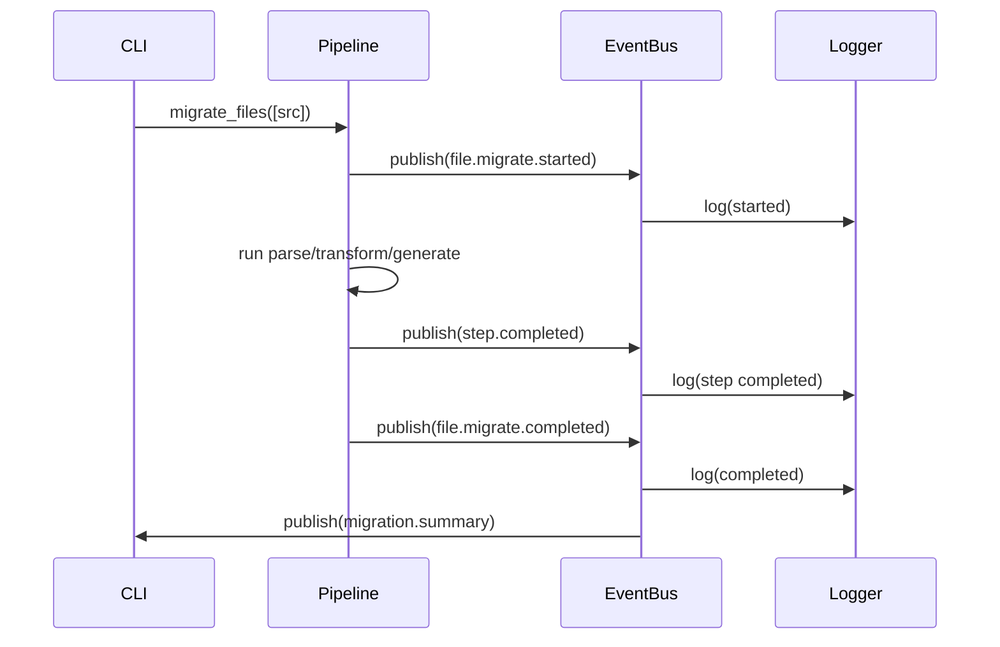

# unittest-to-pytest Migration Tool - Technical Specification

## Architecture Overview

### Design Principles
- **Functional Programming**: Pure functions, immutable data, no side effects
- **Pipeline Architecture**: Job → Task → Step hierarchy with single responsibilities
- **Event-Driven**: Observable pipeline execution via event bus
- **Deterministic**: Same input always produces same output
- **Fail-Safe**: Comprehensive error handling and graceful degradation

### Core Components

```
┌─────────────────┐    ┌─────────────────┐    ┌─────────────────┐
│     Pipeline    │    │   Event Bus     │    │  Configuration  │
│   Orchestrator  │◄──►│   (Observer)    │◄──►│    Manager      │
└─────────────────┘    └─────────────────┘    └─────────────────┘
         │                       │
         ▼                       ▼
┌─────────────────┐    ┌─────────────────┐
│      Jobs       │    │   Subscribers   │
│   (High-level)  │    │  (Logging, UI)  │
└─────────────────┘    └─────────────────┘
         │
         ▼
┌─────────────────┐
│      Tasks      │
│  (Cohesive)     │
└─────────────────┘
         │
         ▼
┌─────────────────┐
│      Steps      │
│   (Atomic)      │
└─────────────────┘
```

## Data Models

### Pipeline Context
Immutable context passed through entire pipeline execution.

```python
@dataclass(frozen=True)
class PipelineContext:
    """Immutable execution context."""
    source_file: str
    target_file: str
    config: MigrationConfig
    run_id: str
    metadata: Dict[str, Any]
    
    def with_metadata(self, key: str, value: Any) -> 'PipelineContext':
        """Return new context with additional metadata."""
        new_metadata = {**self.metadata, key: value}
        return dataclasses.replace(self, metadata=new_metadata)
```

## Configuration Subsystem

The configuration subsystem was expanded to support several cooperating components:

- `Configuration Validator` — enforces cross-field rules and produces structured
    `ValidationError` objects with field-level hints and actionable suggestions.
- `Suggestion Engine` — analyzes project features (via `ProjectAnalyzer`) and
    proposes recommended templates and field overrides.
- `Template Manager` — loads YAML/JSON templates and merges them with CLI flags
    and interactive answers.
- `IntegratedConfigurationManager` — merges CLI flags, templates, and
    interactive responses, validates the merged result, and returns either a
    `ValidatedMigrationConfig` or a detailed list of validation errors and warnings.

The CLI and programmatic callers use this subsystem to produce a final,
validated configuration or to surface helpful guidance for correcting inputs.


### Result Container
Type-safe result handling with comprehensive error information.

```python
@dataclass(frozen=True)
class Result(Generic[T]):
    """Immutable result with error handling."""
    status: ResultStatus  # SUCCESS, WARNING, ERROR, SKIPPED
    data: Optional[T] = None
    error: Optional[Exception] = None
    warnings: List[str] = field(default_factory=list)
    metadata: Dict[str, Any] = field(default_factory=dict)
    
    def map(self, func: Callable[[T], R]) -> 'Result[R]':
        """Apply function to successful result data."""
        if self.is_success() and self.data is not None:
            try:
                return Result(ResultStatus.SUCCESS, func(self.data))
            except Exception as e:
                return Result(ResultStatus.ERROR, error=e)
        return Result(self.status, error=self.error, warnings=self.warnings)
```

### Intermediate Representation
Language-agnostic representation of test semantics.

```python
@dataclass(frozen=True)
class TestModule:
    """Complete test module representation."""
    filepath: str
    imports: List[str]
    classes: List[TestClass]
    standalone_functions: List[TestMethod]
    module_fixtures: List[Fixture]
    module_docstring: Optional[str] = None

@dataclass(frozen=True)
class TestClass:
    """Test class with fixtures and methods."""
    name: str
    docstring: Optional[str]
    methods: List[TestMethod]
    class_fixtures: List[Fixture]
    base_classes: List[str] = field(default_factory=list)

@dataclass(frozen=True)
class TestMethod:
    """Individual test with dependencies and assertions."""
    name: str
    docstring: Optional[str]
    assertions: List[Assertion]
    setup_code: List[str]
    fixture_dependencies: List[str] = field(default_factory=list)
    skip_reason: Optional[str] = None
    parametrize_data: Optional[Dict[str, List[Any]]] = None

@dataclass(frozen=True)
class Fixture:
    """Pytest fixture representation."""
    name: str
    scope: FixtureScope
    setup_code: List[str]
    teardown_code: List[str] = field(default_factory=list)
    dependencies: List[str] = field(default_factory=list)
    yields_value: bool = False
    return_type: Optional[str] = None

class AssertionType(Enum):
    """Types of unittest assertions to transform."""
    EQUAL = "assertEqual"
    NOT_EQUAL = "assertNotEqual"
    TRUE = "assertTrue"
    FALSE = "assertFalse"
    IS = "assertIs"
    IS_NOT = "assertIsNot"
    IS_NONE = "assertIsNone"
    IS_NOT_NONE = "assertIsNotNone"
    IN = "assertIn"
    NOT_IN = "assertNotIn"
    IS_INSTANCE = "assertIsInstance"
    IS_NOT_INSTANCE = "assertNotIsInstance"
    GREATER = "assertGreater"
    GREATER_EQUAL = "assertGreaterEqual"
    LESS = "assertLess"
    LESS_EQUAL = "assertLessEqual"
    ALMOST_EQUAL = "assertAlmostEqual"
    NOT_ALMOST_EQUAL = "assertNotAlmostEqual"
    DICT_EQUAL = "assertDictEqual"
    LIST_EQUAL = "assertListEqual"
    SET_EQUAL = "assertSetEqual"
    TUPLE_EQUAL = "assertTupleEqual"
    COUNT_EQUAL = "assertCountEqual"
    MULTILINE_EQUAL = "assertMultiLineEqual"
    SEQUENCE_EQUAL = "assertSequenceEqual"
    REGEX = "assertRegex"
    NOT_REGEX = "assertNotRegex"
    RAISES = "assertRaises"
    RAISES_REGEX = "assertRaisesRegex"
    WARNS = "assertWarns"
    WARNS_REGEX = "assertWarnsRegex"
    LOGS = "assertLogs"
    NO_LOGS = "assertNoLogs"
    CUSTOM = "custom_assertion"

@dataclass(frozen=True)
class Assertion:
    """Semantic test assertion with comprehensive unittest support."""
    type: AssertionType
    expected: Optional[Expression] = None
    actual: Optional[Expression] = None
    message: Optional[str] = None
    exception_type: Optional[str] = None
    delta: Optional[Expression] = None
    # Additional fields for specialized assertions
    regex_pattern: Optional[str] = None  # For assertRaisesRegex, assertWarnsRegex
    container: Optional[Expression] = None  # For assertIn/assertNotIn
    instance_type: Optional[str] = None  # For assertIsInstance/assertNotIsInstance
    warning_category: Optional[str] = None  # For assertWarns/assertWarnsRegex
    logger_name: Optional[str] = None  # For assertLogs/assertNoLogs
    log_level: Optional[str] = None  # For assertLogs/assertNoLogs
    pattern: Optional[str] = None  # For assertRegex/assertNotRegex
    custom_method: Optional[str] = None  # For custom assertions
    # Collection comparison fields
    count_tolerance: Optional[int] = None  # For assertCountEqual
    sequence_type: Optional[str] = None  # For assertSequenceEqual
```

## Pipeline Implementation

### Base Classes

```python
class Step(ABC, Generic[T, R]):
    """Atomic operation with single responsibility."""
    
    def __init__(self, name: str, event_bus: EventBus) -> None:
        self.name = name
        self.event_bus = event_bus
    
    @abstractmethod
    def execute(self, context: PipelineContext, input_data: T) -> Result[R]:
        """Pure transformation function."""
        pass
    
    def run(self, context: PipelineContext, input_data: T) -> Result[R]:
        """Execute with event publishing and error handling."""
        self._publish_started(context)
        
        try:
            result = self.execute(context, input_data)
        except Exception as e:
            result = Result(ResultStatus.ERROR, error=e)
        
        self._publish_completed(context, result)
        return result

class Task(Generic[T, R]):
    """Collection of related steps."""
    
    def __init__(self, name: str, steps: List[Step], event_bus: EventBus) -> None:
        self.name = name
        self.steps = steps
        self.event_bus = event_bus
    
    def execute(self, context: PipelineContext, input_data: T) -> Result[R]:
        """Execute steps in sequence with short-circuit on error."""
        current_data = input_data
        
        for step in self.steps:
            result = step.run(context, current_data)
            
            if result.is_error():
                return result
            
            if result.data is not None:
                current_data = result.data
        
        return Result(ResultStatus.SUCCESS, current_data)

class Job(Generic[T, R]):
    """High-level processing unit."""
    
    def __init__(self, name: str, tasks: List[Task], event_bus: EventBus) -> None:
        self.name = name
        self.tasks = tasks
        self.event_bus = event_bus
    
    def execute(self, context: PipelineContext) -> Result[R]:
        """Execute all tasks with context threading."""
        current_context = context
        
        for task in self.tasks:
            result = task.execute(current_context, current_context)
            
            if result.is_error():
                return result
            
            # Thread context through pipeline
            if isinstance(result.data, PipelineContext):
                current_context = result.data
        
        return Result(ResultStatus.SUCCESS, current_context)
```

## Transformation Pipeline

### Phase 1: Parsing and Analysis
```python
class ParseSourceStep(Step[str, cst.Module]):
    """Parse source file to concrete syntax tree."""
    
    def execute(self, context: PipelineContext, source_code: str) -> Result[cst.Module]:
        try:
            tree = cst.parse_module(source_code)
            return Result(ResultStatus.SUCCESS, tree)
        except cst.ParserError as e:
            return Result(ResultStatus.ERROR, error=e)

class AnalyzeUnittestPatternsStep(Step[cst.Module, UnittestAnalysis]):
    """Identify unittest patterns and structure."""
    
    def execute(self, context: PipelineContext, tree: cst.Module) -> Result[UnittestAnalysis]:
        analyzer = UnittestPatternAnalyzer()
        analysis = analyzer.analyze(tree)
        
        return Result(
            ResultStatus.SUCCESS,
            analysis,
            metadata={"patterns_found": len(analysis.patterns)}
        )
```

### Suggestion Engine

The `Suggestion Engine` consumes `UnittestAnalysis` and `ProjectAnalyzer` reports
and returns ranked suggestions that can be presented to users or applied by the
`IntegratedConfigurationManager`.

```python
class Suggestion:
    name: str
    reason: str
    fields: Dict[str, Any]  # suggested overrides
    score: float

suggestions = suggestion_engine.suggest(project_report)
```

Each suggestion includes a small set of field overrides and a short rationale.
Integrations (CLI or IDE) may present these with `--suggestions` or during the
interactive configuration flow.


### Phase 2: Transformation to IR
```python
class UnittestToIRStep(Step[Tuple[cst.Module, UnittestAnalysis], TestModule]):
    """Transform unittest CST to intermediate representation."""
    
    def execute(self, context: PipelineContext, 
                input_data: Tuple[cst.Module, UnittestAnalysis]) -> Result[TestModule]:
        tree, analysis = input_data
        
        transformer = UnittestToIRTransformer(analysis)
        ir = transformer.transform(tree, context.source_file)
        
        return Result(
            ResultStatus.SUCCESS,
            ir,
            metadata={
                "classes_found": len(ir.classes),
                "methods_found": sum(len(cls.methods) for cls in ir.classes),
                "fixtures_generated": len(ir.module_fixtures)
            }
        )

class ValidateIRStep(Step[TestModule, TestModule]):
    """Validate IR structure and semantics."""
    
    def execute(self, context: PipelineContext, ir: TestModule) -> Result[TestModule]:
        validator = IRValidator()
        issues = validator.validate(ir)
        
        if issues.critical:
            return Result(
                ResultStatus.ERROR,
                error=ValidationError(f"Critical IR issues: {issues.critical}")
            )
        
        status = ResultStatus.WARNING if issues.warnings else ResultStatus.SUCCESS
        return Result(status, ir, warnings=issues.warnings)
```

### Phase 3: Code Generation
```python
class IRToPytestStep(Step[TestModule, cst.Module]):
    """Generate pytest code from intermediate representation."""
    
    def execute(self, context: PipelineContext, ir: TestModule) -> Result[cst.Module]:
        generator = PytestCodeGenerator(context.config)
        pytest_tree = generator.generate(ir)
        
        return Result(
            ResultStatus.SUCCESS,
            pytest_tree,
            metadata={"fixtures_created": generator.fixture_count}
        )

class FormatCodeStep(Step[cst.Module, str]):
    """Format generated code using black/isort."""
    
    def execute(self, context: PipelineContext, tree: cst.Module) -> Result[str]:
        code = tree.code
        
        if context.config.format_code:
            code = self._apply_formatting(code, context.config)
        
        return Result(ResultStatus.SUCCESS, code)
```

### Phase 4: Code Formatting and Validation
```python
class FormatCodeStep(Step[str, str]):
    """Format generated code using isort and black programmatic APIs."""

    def execute(self, context: PipelineContext, code: str) -> Result[str]:
        if not context.config.format_code:
            return Result(ResultStatus.SUCCESS, code)

        try:
            # Apply isort for import sorting
            formatted_code = self._apply_isort(code, context.config)

            # Apply black for code formatting
            formatted_code = self._apply_black(formatted_code, context.config)

            return Result(
                ResultStatus.SUCCESS,
                formatted_code,
                metadata={
                    "isort_applied": True,
                    "black_applied": True,
                    "original_lines": len(code.splitlines()),
                    "formatted_lines": len(formatted_code.splitlines())
                }
            )
        except Exception as e:
            # If formatting fails, return original code with warning
            return Result(
                ResultStatus.WARNING,
                code,
                warnings=[f"Code formatting failed: {e}"],
                metadata={"formatting_failed": True}
            )

    def _apply_isort(self, code: str, config: MigrationConfig) -> str:
        """Apply isort programmatically to sort imports."""
        import isort

        # Configure isort with appropriate settings
        settings = isort.Settings(
            profile="black",  # Use black-compatible settings
            line_length=config.line_length or 120,
            known_first_party=["pytest"],
            multi_line_output=3,  # Vertical hanging indent
            include_trailing_comma=True,
            force_grid_wrap=0,
            use_parentheses=True,
            ensure_newline_before_comments=True,
        )

        return isort.code(code, config=settings)

    def _apply_black(self, code: str, config: MigrationConfig) -> str:
        """Apply black programmatically for code formatting."""
        import black

        # Configure black with appropriate settings
        mode = black.Mode(
            target_versions={black.TargetVersion.PY38},  # Support Python 3.8+
            line_length=config.line_length or 120,
            string_quotes=black.QuoteStyle.DOUBLE,  # Use double quotes
            preview=False,
        )

        try:
            # Format the code using black's API
            formatted = black.format_str(code, mode=mode)
            return formatted
        except black.NothingChanged:
            return code  # Code was already properly formatted

class ValidateGeneratedCodeStep(Step[str, str]):
    """Validate generated Python code."""

    def execute(self, context: PipelineContext, code: str) -> Result[str]:
        try:
            # Syntax validation
            ast.parse(code)

            # Import validation
            self._validate_imports(code)

            return Result(ResultStatus.SUCCESS, code)
        except SyntaxError as e:
            return Result(ResultStatus.ERROR, error=e)

class WriteOutputStep(Step[str, str]):
    """Write generated code to target file."""

    def execute(self, context: PipelineContext, code: str) -> Result[str]:
        if context.config.dry_run:
            return Result(
                ResultStatus.SUCCESS,
                code,
                metadata={"dry_run": True, "target_file": context.target_file}
            )

        try:
            with open(context.target_file, 'w', encoding='utf-8') as f:
                f.write(code)
            return Result(ResultStatus.SUCCESS, code)
        except IOError as e:
            return Result(ResultStatus.ERROR, error=e)
```

## Formatter Job Architecture

The formatter job is the final step in the migration pipeline, ensuring that all generated pytest code follows consistent formatting standards using isort and black.

### Formatter Job Definition
```python
class FormatterJob(Job[str, str]):
    """Dedicated job for code formatting using isort and black APIs."""

    def __init__(self, event_bus: EventBus, config: MigrationConfig) -> None:
        format_step = FormatCodeStep("format_code", event_bus, config)
        validate_step = ValidateGeneratedCodeStep("validate_formatted_code", event_bus)

        format_task = Task("format_task", [format_step, validate_step], event_bus)

        super().__init__("formatter_job", [format_task], event_bus)

class FormatCodeStep(Step[str, str]):
    """Apply isort and black formatting to generated code."""

    def __init__(self, name: str, event_bus: EventBus, config: MigrationConfig):
        super().__init__(name, event_bus)
        self.config = config

    def execute(self, context: PipelineContext, code: str) -> Result[str]:
        if not self.config.format_code:
            return Result(ResultStatus.SUCCESS, code)

        try:
            # Step 1: Apply isort for import sorting
            formatted_code = self._apply_isort(code)

            # Step 2: Apply black for code formatting
            formatted_code = self._apply_black(formatted_code)

            return Result(
                ResultStatus.SUCCESS,
                formatted_code,
                metadata={
                    "isort_applied": True,
                    "black_applied": True,
                    "line_length": self.config.line_length or 120
                }
            )
        except Exception as e:
            return Result(
                ResultStatus.WARNING,
                code,
                warnings=[f"Code formatting failed: {e}"],
                metadata={"formatting_error": str(e)}
            )

    def _apply_isort(self, code: str) -> str:
        """Apply isort programmatically."""
        try:
            import isort

            settings = isort.Settings(
                profile="black",
                line_length=self.config.line_length or 120,
                known_first_party=["pytest"],
                multi_line_output=3,
                include_trailing_comma=True,
                force_grid_wrap=0,
                use_parentheses=True,
                ensure_newline_before_comments=True,
            )

            return isort.code(code, config=settings)
        except ImportError:
            # isort not available, skip import sorting
            return code

    def _apply_black(self, code: str) -> str:
        """Apply black programmatically."""
        try:
            import black

            mode = black.Mode(
                target_versions={black.TargetVersion.PY38},
                line_length=self.config.line_length or 120,
                string_quotes=black.QuoteStyle.DOUBLE,
                preview=False,
            )

            return black.format_str(code, mode=mode)
        except ImportError:
            # black not available, return unformatted code
            return code
        except black.NothingChanged:
            # Code already formatted
            return code
```

### Pipeline Integration
```python
class MigrationPipeline:
    """Complete migration pipeline with formatter job as final step."""

    def __init__(self, config: MigrationConfig, event_bus: EventBus) -> None:
        self.config = config
        self.event_bus = event_bus

        # Phase 1: Parsing and Analysis
        self.parse_job = ParseSourceJob(event_bus)
        self.analysis_job = AnalyzeUnittestPatternsJob(event_bus)

        # Phase 2: Transformation
        self.transform_job = UnittestToIRJob(event_bus)
        self.ir_validation_job = ValidateIRJob(event_bus)

        # Phase 3: Code Generation
        self.generation_job = IRToPytestJob(event_bus, config)

        # Phase 4: Formatting and Output
        self.formatter_job = FormatterJob(event_bus, config)
        self.output_job = WriteOutputJob(event_bus, config)

    def execute(self, source_file: str) -> Result[str]:
        """Execute complete migration pipeline."""
        context = PipelineContext(
            source_file=source_file,
            target_file=self._get_target_file(source_file),
            config=self.config,
            run_id=str(uuid.uuid4())
        )

        # Execute all jobs in sequence
        jobs = [
            self.parse_job,
            self.analysis_job,
            self.transform_job,
            self.ir_validation_job,
            self.generation_job,
            self.formatter_job,  # Final formatting step
            self.output_job
        ]

        current_context = context
        for job in jobs:
            result = job.execute(current_context)
            if result.is_error():
                return result
            if isinstance(result.data, PipelineContext):
                current_context = result.data

        return Result(ResultStatus.SUCCESS, current_context)
```

## Event System

### Event Types
```python
@dataclass(frozen=True)
class PipelineStartedEvent:
    timestamp: float
    run_id: str
    context: PipelineContext

@dataclass(frozen=True)
class StepStartedEvent:
    timestamp: float
    run_id: str
    context: PipelineContext
    step_name: str

@dataclass(frozen=True)
class StepCompletedEvent:
    timestamp: float
    run_id: str
    context: PipelineContext
    step_name: str
    result: Result[Any]
    duration_ms: float

@dataclass(frozen=True)
class TransformationCompletedEvent:
    timestamp: float
    run_id: str
    context: PipelineContext
    statistics: TransformationStatistics
```

### Event Bus Implementation
```python
class EventBus:
    """Thread-safe event publication and subscription."""
    
    def __init__(self) -> None:
        self._subscribers: Dict[Type, List[Callable]] = defaultdict(list)
        self._lock = threading.Lock()
    
    def subscribe(self, event_type: Type[T], handler: Callable[[T], None]) -> None:
        """Subscribe to specific event type."""
        with self._lock:
            self._subscribers[event_type].append(handler)
    
    def publish(self, event: Any) -> None:
        """Publish event to all subscribers."""
        event_type = type(event)
        handlers = self._subscribers.get(event_type, [])
        
        for handler in handlers:
            try:
                handler(event)
            except Exception as e:
                # Log error but don't break pipeline
                logger.error(f"Event handler error: {e}")
```

## Configuration System

### Configuration Schema
```python
@dataclass(frozen=True)
class MigrationConfig:
    """Migration behavior configuration."""
    # Output settings
    target_root: Optional[str] = None
    preserve_structure: bool = True
    backup_originals: bool = True
    
    # Transformation settings
    convert_classes_to_functions: bool = True
    merge_setup_teardown: bool = True
    generate_fixtures: bool = True
    fixture_scope: FixtureScope = FixtureScope.FUNCTION
    
    # Code quality settings
    format_code: bool = True
    optimize_imports: bool = True
    add_type_hints: bool = False
    line_length: Optional[int] = None  # Use black default (120) if None
    
    # Behavior settings
    dry_run: bool = False
    fail_fast: bool = False
    parallel_processing: bool = True
    # Per-run worker tuning removed from public API (max_workers omitted)
    
    # Reporting settings
    verbose: bool = False
    generate_report: bool = True
    report_format: str = "json"  # json, html, markdown

@dataclass(frozen=True) 
class TransformationRules:
    """Specific transformation behavior rules."""
    assertion_mappings: Dict[str, AssertionType]
    skip_patterns: List[str]
    custom_fixture_generators: Dict[str, str]
    import_mappings: Dict[str, str]
```

## Error Handling Strategy

### Error Categories
1. **Parse Errors**: Invalid Python syntax, libcst parsing failures
2. **Transformation Errors**: Unsupported unittest patterns, IR validation failures  
3. **Generation Errors**: Invalid IR state, code generation failures
4. **IO Errors**: File access, permission, encoding issues
5. **Configuration Errors**: Invalid settings, missing dependencies

### Error Recovery
```python
class ErrorRecoveryStrategy:
    """Strategies for handling different error types."""
    
    def handle_parse_error(self, error: cst.ParserError, context: PipelineContext) -> Result:
        """Attempt to fix common parse issues."""
        # Try encoding detection, syntax repair, etc.
        pass
    
    def handle_transformation_error(self, error: TransformationError, 
                                   context: PipelineContext) -> Result:
        """Provide fallback transformations or skip problematic sections."""
        # Identify problematic pattern, apply conservative transformation
        pass
    
    def handle_generation_error(self, error: GenerationError, 
                               context: PipelineContext) -> Result:
        """Generate minimal valid pytest code."""
        # Create basic test structure, report manual intervention needed
        pass
```

## EventBus: explicit events and payload schemas

The `EventBus` emits a set of well-known, namespaced events. Each event is
represented as a simple object with `name: str` and `payload: Dict[str, Any]`.

Official event names and payloads:

- `file.migrate.started` — {"source": str, "timestamp": float, "run_id": str}
- `file.migrate.completed` — {"source": str, "target": Optional[str], "wrote": bool, "duration_s": float, "run_id": str}
- `step.started` — {"step": str, "source": str, "timestamp": float, "context": Dict[str, Any]}
- `step.completed` — {"step": str, "source": str, "duration_s": float, "status": "success"|"warning"|"error", "metadata": Dict[str, Any]}
- `migration.summary` — {"run_id": str, "files_processed": int, "errors": int, "warnings": int}
- `error.reported` — {"category": str, "location": Optional[str], "message": str, "suggestions": List[str]}

Event handlers must be resilient; exceptions from handlers are logged and do
not interrupt the pipeline. Handlers receive the raw event object and may
inspect `event.name` and `event.payload`.

Sequence diagram: Event emission during file migration





Figure: Event emission sequence (SVG includes mermaid source as fallback).


## Performance Considerations

### Parallelization Strategy
- File-level parallelization for batch processing
- Pipeline steps remain sequential within single file
- Shared event bus with thread-safe publishing
- Configurable worker pool size

### Memory Management
- Stream processing for large files
- Lazy evaluation of transformation rules
- Garbage collection of intermediate results
- Configurable memory limits

### Caching Strategy
- Parse result caching for unchanged files
- Pattern analysis caching
- Import resolution caching
- Configurable cache invalidation

## Testing Strategy

### Unit Testing
- Each step, task, and job independently tested
- Property-based testing for transformation correctness
- Mock event bus for isolation
- Comprehensive error case coverage

### Integration Testing
- End-to-end pipeline execution
- Real-world unittest file processing
- Performance benchmarking
- Memory usage profiling

### Dogfooding
- Tool migrates its own test suite
- Continuous validation of transformation quality
- Real-world edge case discovery

## Extension Points

### Custom Steps
```python
class CustomTransformationStep(Step[TestModule, TestModule]):
    """User-defined transformation logic."""
    
    def __init__(self, name: str, transformation_func: Callable, event_bus: EventBus):
        super().__init__(name, event_bus)
        self.transform = transformation_func
    
    def execute(self, context: PipelineContext, ir: TestModule) -> Result[TestModule]:
        return Result(ResultStatus.SUCCESS, self.transform(ir))
```

### Plugin System
```python
class MigrationPlugin(ABC):
    """Plugin interface for extending migration capabilities."""
    
    @abstractmethod
    def get_steps(self) -> List[Step]:
        """Return additional pipeline steps."""
        pass
    
    @abstractmethod
    def get_event_handlers(self) -> Dict[Type, Callable]:
        """Return event handlers to register."""
        pass
```

This specification provides a comprehensive technical foundation for implementing the unittest-to-pytest migration tool with the pipeline architecture we discussed.
